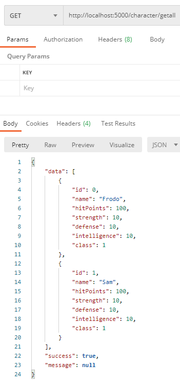

# .NET Core RPG Character REST API 
A simple .NET Core REST API that handles CRUD operations with an RPG theme

Folder structure is as follows:
* Controllers
* Dtos
* Models
* Services

The API makes use of automapper and data transfer objects 

This API is initialised on localhost:5000 and can perform the following operations: 

## GET: http://localhost:5000/character/getall
This method returns all the characters present in the API

## GET: http://localhost:5000/character/{int id}
This method returns a character with a specified id e.g. 1

## POST: http://localhost:5000/character/
This method allows a user to add a new character into the list with the following json inputs:
            {
              "id": int
              "name": string
              "hitPoints": int
              "strength": int
              "defense": int
              "intelligence": int
              "class": int
             }
             
## PUT: http://localhost:5000/character/{int id}
This method allows a user to update data for an existing character using their id. 
Uses the same json format as adding a new character.

## DELETE: http://localhost:5000/character/{int id}
This method deletes an existing character within the API using a specified id 

## How to run:
Download or clone the repository and run within VS Studio or VS Code

Send http requests using Postman or similar

